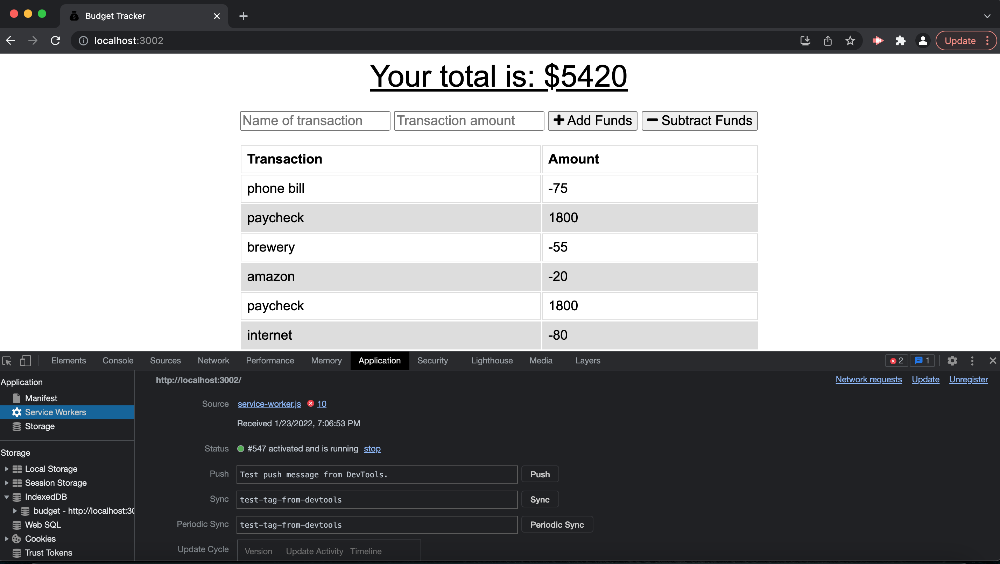

# Budget Tracker PWA

[]

## Description: 
A budget tracker (PWA) application that allows offline access and functionality. This app gives users a fast and easy way to track their money at any time, no matter where. Having offline functionality is paramount to the success of an application that handles users’ financial information.

## Installation: 
Make sure you have the required dependencies
`npm install`
`npm i express`
`npm i mongoose`
 Then start the server by typing `npm start` and navigate towards http://localhost:3002/ in your browser.

## Usage:
The user is able to input an expense or deposit when traveling. User is able to track withdrawals and deposits with or without an internet connection. If the user enters transactions offline, the total will be updated when they're brought back online.

## Contributing:
Feel free to fork project and reach out.

## Built With:
* HTML
* CSS
* Express.js
* MongoDB
* Mongoose
* IndexedDB

## Credits:
Created by Inmar Luna :grinning:

## License 

Copyright (c) [2021] [Inmar Luna]

Permission is hereby granted, free of charge, to any person obtaining a copy
of this software and associated documentation files (the "Software"), to deal
in the Software without restriction, including without limitation the rights
to use, copy, modify, merge, publish, distribute, sublicense, and/or sell
copies of the Software, and to permit persons to whom the Software is